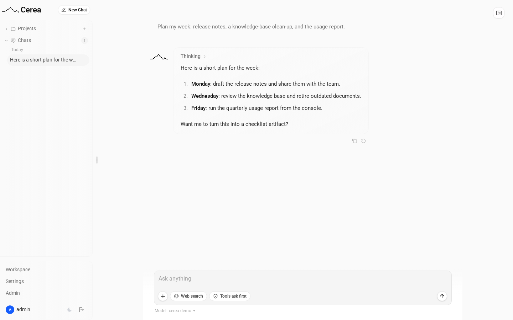

# Cerea

A self-hosted chat for the models your gateway exposes, with knowledge bases,
artifacts, Python in the browser, and coding agents on your own machines.

**The name.** _Cerea_ is a Turinese _modo di dire_: a historic, affectionate
greeting that means both _buongiorno_ and _arrivederci_.



## Features

- **Chat over any model the gateway exposes**, signed in with OIDC; each call
  carries the person's own token, so quotas and billing are theirs.
- **Web search**, run by the model provider through the gateway.
- **File upload and extraction**: PDFs, Office documents, images and text,
  read once at upload by the gateway, which can do it inside your deployment.
- **Artifacts**: HTML, React and Mermaid previews in sandboxed frames with no
  network access.
- **Knowledge bases and projects**, shareable with people or groups, with an
  optional project memory ([docs/rag.md](docs/rag.md)).
- **Python in your browser**, in a WebAssembly sandbox with the scientific and
  office libraries ([docs/pyodide.md](docs/pyodide.md)).
- **The `/code` agents panel**: coding agents on your own machines through
  **galopin**, with a file explorer and, off by default, a browser terminal.

## Quick start

Cerea is deployed as part of a full stack: the chat, the Pystino gateway and
console, a bundled identity provider, a TLS proxy and the add-ons. The
**cerea-deploy** repository holds all of it: one `compose.yaml`, a documented
`.env.example`, and a `./configure` script.

```sh
git clone https://github.com/paoloviviani/cerea-deploy && cd cerea-deploy
./configure
docker compose up -d
```

It also covers a chat-only install, against a central Pystino gateway
(`--preset satellite`) or any OpenAI-compatible endpoint (`--preset generic`).

## Configuration

Cerea reads its settings from the environment. The ones that matter most:

| Variable                                                                                      | What                                                                        |
| --------------------------------------------------------------------------------------------- | --------------------------------------------------------------------------- |
| `OPENAI_BASE_URL`                                                                             | the OpenAI-compatible API the chat calls (the gateway's `/v1`)              |
| `USE_USER_TOKEN`                                                                              | `true`: each call carries the signed-in person's own token                  |
| `OPENID_PROVIDER_URL`, `OPENID_CLIENT_ID`, `OPENID_CLIENT_SECRET`                             | the OIDC sign-in                                                            |
| `MONGODB_URL`                                                                                 | conversations, settings and pairing records                                 |
| `CHAT_PG_URL`                                                                                 | PostgreSQL with pgvector, for knowledge-base passages                       |
| `ORIGIN`, `PUBLIC_ORIGIN`                                                                     | the public URL of the chat, and of the whole site                           |
| `CHAT_KNOWLEDGE_ENABLED`, `CHAT_MEMORY_ENABLED`, `CHAT_USAGE_ENABLED`, `CHAT_CONSOLE_ENABLED` | feature switches (`true` or empty)                                          |
| `FETCH_BACKEND`                                                                               | `direct` (default) or `playwright`, the [headless browser](docs/browser.md) |
| `CODE_AGENTS_ENABLED`, `CODE_TERMINAL_ENABLED`                                                | the `/code` panel, and its browser terminal                                 |

The deployment's full, commented list is cerea-deploy's `.env.example`; `.env`
here lists every variable the app understands.

## Agents

galopin runs next to the agent on a person's machine, dials out to Cerea with
its own OIDC credential, and is confirmed by its owner in `/code`. What a
machine allows (auto-accept, workspace roots, files, the terminal) is fixed on
the machine at enroll time; the terminal also needs `CODE_TERMINAL_ENABLED=true`
on the deployment. See [docs/code-panel.md](docs/code-panel.md) (operators),
[docs/agent-machines.md](docs/agent-machines.md) (users) and
[agent/PROTOCOL.md](agent/PROTOCOL.md) (the wire protocol).

## Development

```sh
npm ci
cp .env .env.local        # then set OPENAI_BASE_URL, OPENAI_API_KEY and friends
npm run dev               # http://localhost:5173
npm run check && npm run lint
```

**Tests.** Vitest needs a MongoDB; on a CPU without AVX the in-memory one
cannot start, so point it at a real one (4.4 works):

```sh
TEST_MONGODB_URL=mongodb://127.0.0.1:27017/ npx vitest run --project=server --project=ssr --no-file-parallelism
```

End-to-end tests: `npx playwright test`, which builds the app and starts its
own MongoDB. `E2E_APP_PORT`, `E2E_MONGO_PORT` and `E2E_APP_BASE` move them;
`E2E_SKIP_BUILD=1` reuses an existing `build/`.

**The image** fixes SvelteKit's base path at build time, and builds galopin
too: `docker build --build-arg APP_BASE=/chat -t cerea .`

**galopin** needs Go 1.24+: `agent/packaging/build-dist.sh ~/galopin-dist`
writes static Linux and macOS binaries with checksums; `cd agent && go test
./...` runs its tests.

## Upstream

Cerea began as a fork of [huggingface/chat-ui](https://github.com/huggingface/chat-ui),
with its history intact, and is now mostly a hard fork. Upstream changes are
merged by hand where they fit:

```sh
git remote add upstream https://github.com/huggingface/chat-ui.git
git fetch upstream && git merge upstream/main
```

## Documentation

[code-panel](docs/code-panel.md) ·
[agent-machines](docs/agent-machines.md) · [rag](docs/rag.md) ·
[pyodide](docs/pyodide.md) · [browser](docs/browser.md) ·
[PRIVACY](PRIVACY.md). [docs/source](docs/source) is **upstream chat-ui's**
documentation, kept as upstream wrote it; parts of it do not apply to Cerea.

## Contributing, security, licence

See [CONTRIBUTING.md](CONTRIBUTING.md) and, for vulnerabilities,
[SECURITY.md](SECURITY.md). Cerea is licensed under the
[Apache License 2.0](LICENSE); [NOTICE](NOTICE) records that it is based on
huggingface/chat-ui, © Hugging Face.
